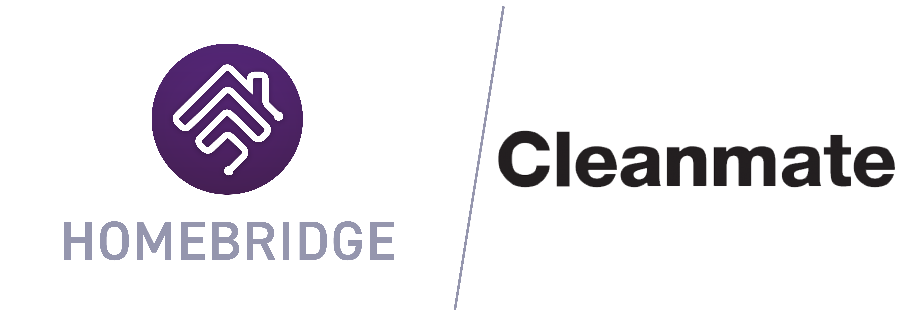

<p align="center">
  
</p>

# Homebridge Cleanmate
Cleanmate is a popular robot vacuum cleaner in Sweden. This plugin allows you to control it from HomeKit.

Right now there is no official documentation or API over how to control the robot. To develop this plugin the tcp request to and from the robot has been analyzed. 


<br>**Note:** This plugin has only been tested for the Cleanmate S995. Please make a Pull Request if you get it working with another model.

## Features
* **Fan** as On-/Off-switch
  * **Fanspeed** controls the cleaning mode (Silent, Standard, Intense)
  * **Rotate direction** controls the mop mode (configurable in config)
* Pause **Switch** that will pause the robot when enabled and continues when disabled
* **Occupancy sensor** that will fire when the robot is docked (optional and can be inverted in config) 
* **Motion sensor** that will fire if the robot has a problem (optional)

## Requirements
- [Homebridge](https://github.com/nfarina/homebridge) HomeKit support for the impatient
- [Cleanmate robot](https://www.cleanmate.se/) The vacuumm cleaner
  - Ip address of the robot (use a static ip)
  - Authentication code for the robot ([How to get the authentication code](#how-to-get-the-authentication-code))

## Instructions
### Installation
This plugin can easily be installed from Homebridge UI or `sudo npm install -g homebridge-cleanmate`

### Config
This is an accessory plugin, the configuration should be set under accessories in the config file. Multiple accessories can be added, make sure they have unique names.

#### Example config
```json
{
  "bridge": {
    "name": "Homebridge",
    "username": "CC:22:3D:E3:CE:30",
    "port": 51826,
    "pin": "012-34-567"
  },
  "accessories": [
    {
      "accessory": "Cleanmate",
      "name": "Cleanmate robot",
      "ipAddress": "192.168.86.22",
      "authCode": "0123456789",
    }
  ]
}
```

### Parameters
| Parameter                    | Description                                                        |  Default  |  type   |
| ---------------------------- | ------------------------------------------------------------------ | :-------: | :-----: |
| `accessory`                  | always `"Cleanmate"`                                               |     -     | String  |
| `name`                       | The name of the robot                                              |     -     | String  |
| `ipAddress`                  | The ip address of the robot                                        |     -     | String  |
| `authCode`                   | The authentication code for the robot                              |     -     | String  |
| `pollInterval?`              | How often the status should be updated (in seconds)                |    15     | Number  |
| `lowBatteryPercentage?`      | When should the robot report low battery                           |    15     | Number  |
| `clockwiseMode?`             | Which [mop mode](#mop-modes) to use when clockwise is used         | 20 (High) | Number  |
| `counterClockwiseMode?`      | Which mop mode to use when counter clockwise is used               | 60 (Low)  | Number  |
| `motionSensor?`              | Add a motion sensor that triggers when the robot has a problem     |   true    | Boolean |
| `occupancySensor?.enable?`   | Add a occupancy sensor that will represent if the robot is at dock |   true    | Boolean |
| `occupancySensor?.inverted?` | Invert occupancy sensor, activate when robot is at dock            |   false   | Number  |

### Mop Modes
| Mode   | Key |
| ------ | --- |
| High   | 20  |
| Medium | 40  |
| Low    | 60  |

## How to get the authentication code
Currenly there is no easy way to get the authentication code (please let me know if there is).

The way to obtain a authentication code is to listen to a tcp packet when your phone sends a command to the robot. [Wireshark](https://www.wireshark.org/) is a great program to use for listening to network traffic.